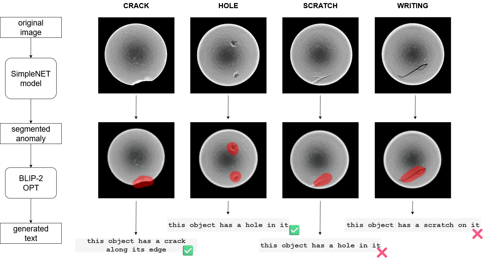
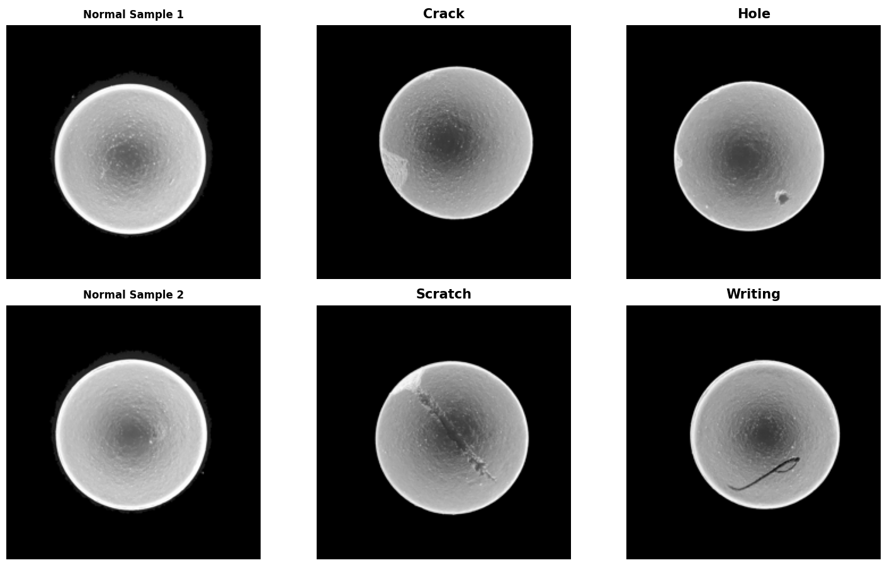
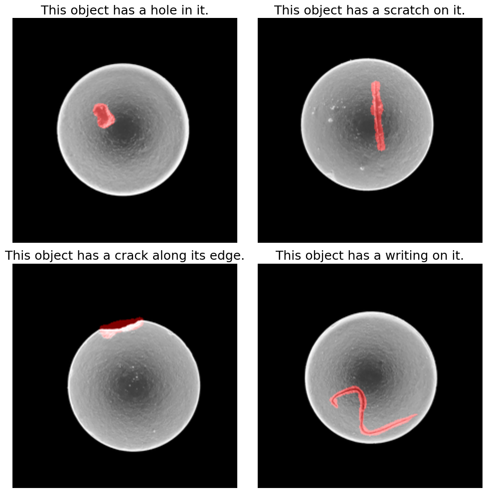
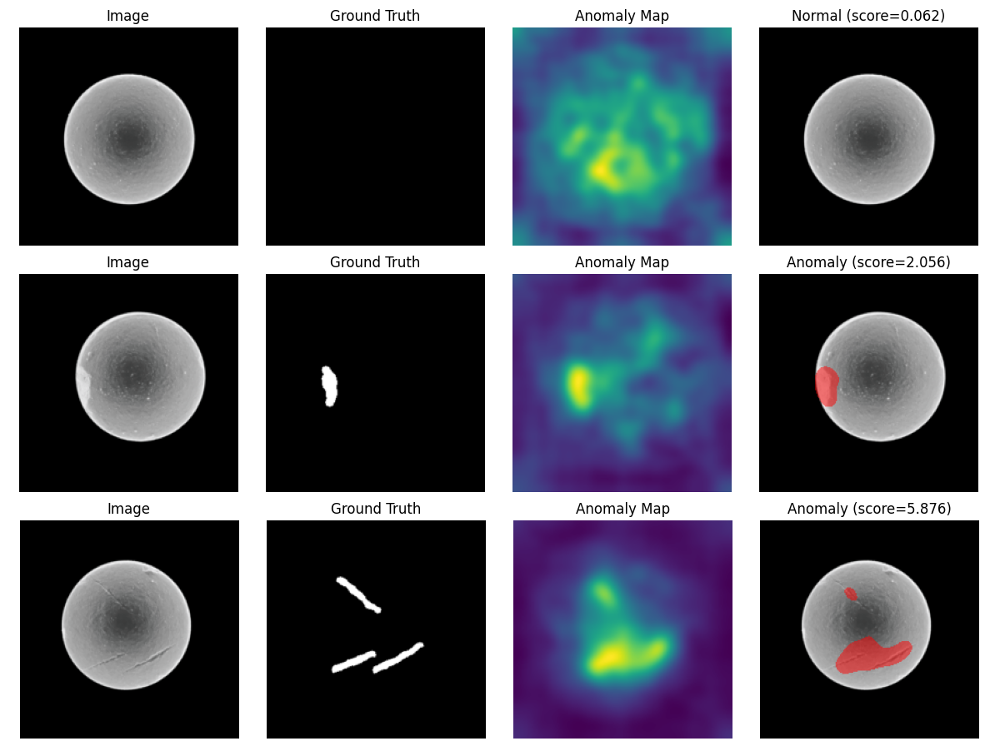

# Anomaly Detection in Industrial Environment with Vision-Language Model Description

**Master's Thesis Project - Faculty of Electrical Engineering and Computing, University of Zagreb**

A comprehensive system for automated anomaly detection and natural language description in industrial manufacturing, combining SimpleNet architecture for anomaly detection and segmentation with BLIP-2 vision-language model for generating textual descriptions of detected defects.

## Overview

This project presents a novel approach to industrial quality control by combining state-of-the-art anomaly detection with natural language generation. The system can not only detect and localize defects in manufactured products but also provide human-readable descriptions of the detected anomalies, making it valuable for automated quality assurance in industrial environments.

### Approach

The system operates in two stages:
1. **Anomaly Detection**: SimpleNet model detects and segments anomalies in product images
2. **Description Generation**: BLIP-2 with LoRA fine-tuning generates natural language descriptions of detected defects

## Key Features

- **High-Performance Anomaly Detection**: Achieves 99.1% I-AUROC and 97.2% P-AUROC on custom dataset
- **Natural Language Descriptions**: Generates human-readable descriptions of detected anomalies
- **Custom Dataset**: PolanecAD dataset with 191 images of magnesium tablets with various defect types
- **Parameter-Efficient Training**: Uses LoRA (Low-Rank Adaptation) for efficient fine-tuning
- **Industrial Application**: Designed for pharmaceutical manufacturing quality control
- **Comprehensive Evaluation**: Multiple metrics including BLEU scores and confusion matrices

## Architecture

### Anomaly Detection Pipeline (SimpleNet)

The SimpleNet architecture consists of:
- **Feature Extractor**: Pre-trained WideResNet50 for feature extraction
- **Feature Adapter**: MLP for domain adaptation to industrial images
- **Anomaly Generator**: Gaussian noise injection for synthetic anomaly generation
- **Discriminator**: Binary classifier for normal/anomalous pixel classification

### Vision-Language Model (BLIP-2 + LoRA)

The description generation system uses:
- **Vision Encoder**: CLIP-based image encoder
- **Q-Former**: Querying Transformer for cross-modal alignment
- **Language Model**: OPT-2.7B for text generation
- **LoRA Adaptation**: Parameter-efficient fine-tuning with only 0.8% trainable parameters

## Datasets

### PolanecAD Dataset

Custom dataset created for this project, following MVTec AD structure:

| Split | Type | Count | Description |
|-------|------|-------|-------------|
| Train | Good | 126 | Normal magnesium tablets |
|  | Good | 15 | Normal test samples |
|  | Crack | 15 | Tablets with cracks |
| Test | Hole | 10 | Tablets with holes |
|  | Scratch | 15 | Tablets with scratches |
|  | Writing | 10 | Tablets with writing marks |
| **Total** | | **191** | |

### VLM Training Dataset

- **960 augmented samples** with image-caption pairs
- **Natural language descriptions** for each defect type
- **Segmented images** with highlighted anomaly regions

## Results

### Anomaly Detection Performance

| Metric | Score |
|--------|-------|
| I-AUROC | 0.991 |
| P-AUROC | 0.972 |

### Vision-Language Model Performance

| Metric | Score |
|--------|-------|
| BLEU Score | 0.529 |
| Classification Accuracy | 30.7% |

### Confusion Matrix for Defect Classification

| Actual/Predicted | Crack | Hole | Scratch | Writing |
|------------------|-------|------|---------|---------|
| Crack | 17 | 27 | 12 | 0 |
| Hole | 12 | 31 | 4 | 0 |
| Scratch | 6 | 15 | 11 | 0 |
| Writing | 8 | 19 | 30 | 0 |

## Usage

### PolanecAD dataset

Download both PolanecAD and PolanecVLM datasets from Hugging Face: https://huggingface.co/datasets/tonipol/PolanecAD and https://huggingface.co/datasets/tonipol/PolanecVLM

PolanecAD is for anomaly detection model, PolanecVLM is for VLM description model.

### Anomaly detection model

1. Go into `AnomalyDetectionModel` directory
2. Setup virtual environment and install required dependencies
3. Download pretrained weights for SimpleNet model from Hugging Face: https://huggingface.co/tonipol/simplenet-polanecad and put them in `AnomalyDetectionModel\results\PolanecAD_Results\simplenet_polanecad\run_40ep\models\0\polanecad_tablet` directory
4. Put PolanecAD dataset in `AnomalyDetectionModel\PolanecAD` directory
5. Run the model with `run.sh` script

### VLM description model
1. Go into `VLMDescriptionModel` directory
2. Download pretrained weights for VLM model from Hugging Face: https://huggingface.co/tonipol/blip2-opt-2.7b-anomaly-detection-description (only if running locally)
3. Run `VLM-AD-description.ipynb` notebook

## Model Performance

### Training Configuration

#### SimpleNet Parameters
- **Meta Epochs**: 40
- **GAN Epochs**: 4
- **Noise Standard Deviation**: 0.015
- **Discriminator Learning Rate**: 0.0002
- **Patch Size**: 3×3
- **Target Embedding Dimension**: 1024

#### BLIP-2 + LoRA Parameters
- **Training Epochs**: 10
- **Learning Rate**: 1e-4
- **Batch Size**: 4
- **LoRA Rank**: 16
- **LoRA Alpha**: 32
- **Trainable Parameters**: 0.8% (30.4M/3.8B)

### Computational Requirements

- **SimpleNet Training**: ~80 hours on CPU
- **VLM Training**: ~4 hours on Tesla P100 GPU
- **Inference**: Real-time capable on modern hardware

## Master's Thesis

**"Detekcija anomalija u industrijskom okruženju"** (Anomaly Detection in Industrial Environment)
- **Author**: Toni Polanec
- **Institution**: Faculty of Electrical Engineering and Computing (FER), University of Zagreb
- **Program**: Master's in Computer Science
- **Supervisor**: Prof. Dr. Sc. Tomislav Hrkać
- **Year**: 2025
- **Language**: Croatian with English abstract

## Available Models and Datasets

All models and datasets are publicly available on Hugging Face:

### Datasets
- [PolanecAD Dataset](https://huggingface.co/datasets/tonipol/PolanecAD)
- [PolanecVLM Dataset](https://huggingface.co/datasets/tonipol/PolanecVLM)

### Models
- [SimpleNet Model](https://huggingface.co/tonipol/simplenet-polanecad)
- [BLIP-2 VLM Model](https://huggingface.co/tonipol/blip2-opt-2.7b-anomaly-detection-description)

### Source Code
- [GitHub Repository](https://github.com/tonipolanec/Anomaly-detection-with-VLM-description)

*This repository contains the complete implementation of a Master's thesis project from the Faculty of Electrical Engineering and Computing, University of Zagreb. The work demonstrates advanced knowledge in computer vision, deep learning, and industrial applications, representing graduate-level research in artificial intelligence and machine learning.*

